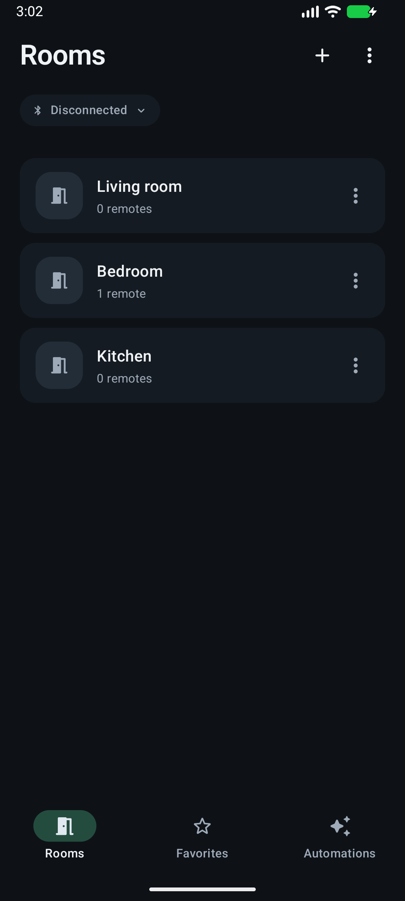
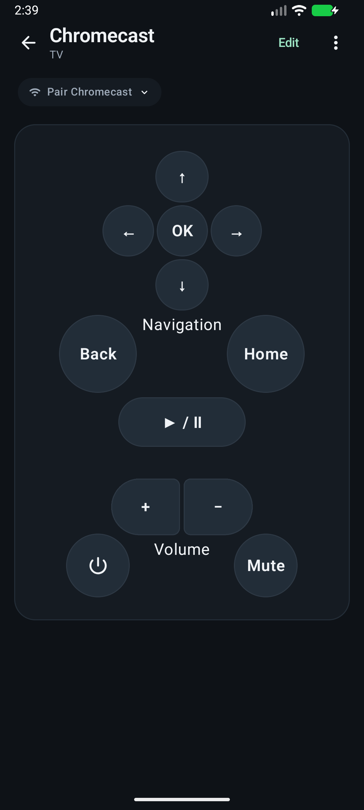

# Flipper Home

A native Android universal remote. Organize your house into rooms, build simple remote layouts, and mix Flipper Zero infrared/Sub-GHz buttons with Chromecast controls on one remote.

**Android 12+ · Kotlin / Jetpack Compose · Local storage · Dark mode**

<p>


</p>

## Install

1. Open [Releases](https://github.com/tkeren/flipper-home/releases) on your Android phone and download `flipper-home-*.apk`. Android Studio is not needed.
2. Open the APK. If prompted, allow your browser/file manager to **install unknown apps**, then install Flipper Home.
3. Open the app and create your first room with **+**. New installs start empty; screenshots show example rooms.

The initial release is an **early testing build signed with a debug certificate**, not a Play Store release. A SHA-256 checksum is attached. Updates signed with the same certificate preserve app data. Builds from another computer or CI may have a different certificate and cannot replace an existing installation; uninstalling removes saved layouts and TV pairing.

## Features

- Rooms with editable Lights, TV, Chromecast, Fan and Blank remotes.
- Simple button shapes/sizes, optional text, text sizes, theme colors and drag placement. Independently mapped rocker/pad parts.
- Phone-driven capture, Test, Save and **Save & map next**, or import saved Flipper signals.
- Press-and-hold transmission for dimming and other continuous commands.
- Automations combining taps, **0.1–60 second holds** and pauses (**200 ms** by default).
- Favorites for remotes, buttons and automations; saved-signal editing/relearning with references preserved.

## Connect Flipper

1. Enable Bluetooth on Flipper and return to its home screen. Disconnect other apps holding its Bluetooth connection.
2. Tap **Disconnected** in Flipper Home, grant **Nearby devices**, and select Flipper.
3. Accept Android's pairing prompt and confirm the code shown on Flipper if requested. Wait for connected status.

Android settings may say an app is needed. Use Flipper Home's picker: this is authenticated BLE/RPC, not audio. The official Flipper app is not required. The app retains BLE while switching apps and attempts reconnect when reopened. A connection notification supports Android's foreground service. **Disconnect** suppresses auto-reconnect until you select a device again; force-stopping requires a new connection.

## Map and customize a remote

1. Open a room → **+** → select a template → **Add**.
2. Tap an unlearned button or rocker/pad part. Choose **Infrared** or **Sub-GHz**.
3. For infrared, aim the original remote at Flipper. For Sub-GHz, choose your remote's frequency/preset; Flipper's Frequency Analyzer identifies activity. Existing compatible signals on the remote supply radio settings automatically.
4. Tap **Capture**, wait for receiver-ready, then press the original remote.
5. **Test button**, then **Save** or **Save & map next**. The screen names/highlights the current target.

Phone capture automatically installs a receive-only companion over Bluetooth. **The bundled companion targets Momentum `mntm-dev[18-08-2026]`, f7 API 87.1 specifically.** Other firmware may need a rebuilt companion; the app never flashes firmware. See [companion documentation](flipper_capture/README.md).

To import saved signals, use the room's **⋮ → Import signal** and browse `.ir`/`.sub` files on Flipper's SD card. An IR file can contain multiple named commands; each Sub-GHz file represents one command. Files copied with qFlipper can be imported too.

Choose **Edit**, or long-press empty remote background, to style/add buttons and drag them into place; **Save** finishes the layout. Holding a mapped button still sends its command. Use room **⋮** to rename/delete a room and **Remote settings** to rename/move/delete a remote.

## Chromecast / Google TV

1. Put your phone and **Chromecast with Google TV** or compatible Android/Google TV device on the same network.
2. Open a room → **+ → Chromecast → Add**.
3. Select the discovered TV, or enter its IP manually.
4. Enter the six-character code displayed on the TV.

Navigation, Back, Home, play/pause, volume, mute and power use local Wi-Fi independently of Flipper. **Edit → Add button → Flipper signal** adds lights/IR commands to that layout; **Google TV command** adds another network button.

This uses Android TV Remote v2, not signal capture or Cast streaming. Older cast-only Chromecasts lack this navigation service. Power/volume depend on HDMI-CEC and device configuration; learned Flipper infrared buttons are another option. Voice search is not implemented.

## Automations and saved signals

Choose **Edit → Add button → Automation → New automation**. The picker starts on this remote; browse **Rooms → Remotes → Buttons** for other actions. Select actions in order, repeat/reorder/remove steps, and choose **Tap** or timed **Hold** per step. Save, style and position the button. **Use existing automation** reuses a sequence without duplication.

Example: hold Light 1 Dim for **5 seconds**, pause **200 ms**, then hold Light 2 Dim for **5 seconds**. Mixed Flipper/TV sequences require both devices reachable. They run manually while the app is open; **Stop automation**, leaving the app or losing a required connection cancels playback. Failed actions stop the sequence and report partial completion.

Open **⋮ → Saved signals** to test, rename, relearn, delete or change a capture's file, IR signal name or Sub-GHz tap duration. Relearning preserves references; deleting removes app references while leaving the SD-card file.

## Compatibility and limits

| Capability | Support |
| --- | --- |
| Phone | Android 12 / API 31+; no iOS build |
| Flipper | Authenticated BLE/protobuf RPC; firmware playback apps must support the commands |
| Phone capture | Momentum SDK `d3f89dfe`, f7 API 87.1; exact firmware above |
| Infrared | Saved named/RAW IR; companion captures decoded/raw IR |
| Sub-GHz capture | Decoded static signals, internal CC1101; AM650, AM270, FM238, FM476 |
| Sub-GHz playback | Compatible `.sub` files; RAW playback unverified |
| Google TV | Remote v2; native simulated-TV tests passed, physical Chromecast acceptance pending |
| Automations | Manual sequences; no scheduling/background execution |

Capture excludes rolling-code/dynamic signals and RAW Sub-GHz. This companion does not imply compatibility with every Momentum version or stock firmware. Playback also depends on regional radio restrictions. Use devices you own or have permission to control.

IR needs line of sight. Flipper's range/position determines which appliances it reaches; one portable Flipper cannot cover every room simultaneously. Transmission doesn't verify appliance state. Use discrete **Off** commands rather than toggles for all-off sequences. Zigbee and unrelated Bluetooth/Wi-Fi appliances need separate integrations.

## Troubleshooting

| Problem | Try this |
| --- | --- |
| Flipper not found | Enable Bluetooth, return to home, keep nearby and disconnect other clients. Unnamed candidates may appear as **Possible Flipper**. Saved pairings must be detected nearby. |
| Timeout / GATT 133 | Retry after closing other clients. Toggling phone Bluetooth/restarting Flipper has recovered failed sessions. Check Android's pairing notification. |
| Incompatible capture firmware | Check the exact firmware/API; import a Flipper-recorded signal or rebuild the companion. |
| Sub-GHz capture is noise | Check frequency/preset and relearn with the remote closer. Frequency Analyzer detects activity; capture a decoded command separately. |
| Dimming barely changes | Hold the button, increase tap duration or use a timed Hold automation step. |
| TV not found | Same network, no isolated guest Wi-Fi, try manual IP; its Android TV remote service must be available. |
| TV identity changed | Pair again, for example after resetting the TV. Control connections reject changed keys. |
| APK update won't install | Check Android version/signing certificate. Uninstalling to fix certificate mismatch loses app data. |

Report Android/app versions, exact firmware/API or TV model, reproduction and error text in [Issues](https://github.com/tkeren/flipper-home/issues). BLE logs use `FlipperHomeBLE`. Don't post codes, private captures or app-data backups.

## Privacy

Home data stays in private app storage; captures live on Flipper's SD card. No accounts, analytics or cloud backend. Bluetooth supports Flipper; network permission supports local TV discovery/control. TV private keys stay in Android Keystore, pairing codes aren't stored, and connections verify the saved TV public-key fingerprint.

## Build

Install Android Studio, SDK **35** and JDK **21**. Gradle **8.13**, Android Gradle Plugin **8.13.2**, Kotlin **2.0.21**; daemon criteria select JetBrains JDK 21. Android Studio generates the ignored `local.properties` SDK path.

```sh
git clone https://github.com/tkeren/flipper-home.git
cd flipper-home
chmod +x gradlew  # macOS / Linux
./gradlew testDebugUnitTest lintDebug assembleDebug
```

Windows: `.\gradlew.bat testDebugUnitTest lintDebug assembleDebug`.

APK: `app/build/outputs/apk/debug/app-debug.apk`. Install via Android Studio **Run** or `adb install -r app/build/outputs/apk/debug/app-debug.apk`. First build downloads dependencies/SDK/toolchain. The bundled FAP allows Android builds without a Flipper SDK; rebuilding it is documented separately.

The initial release passes **114 JVM tests**, assembly and lint (with warnings). Isolated native checks cover saved data, Keystore mutual TLS, authenticated TV pairing, taps, holds, cancellation, reconnect and identity rejection against a localhost fixture. Flipper connection and Princeton light capture/playback have been exercised on hardware; all remotes/firmwares have not been validated.

See [CONTRIBUTING.md](CONTRIBUTING.md) and [architecture notes](docs/ARCHITECTURE.md). CI builds/tests and provides a debug APK artifact; it sends no physical-device commands.

## Credits and licensing

Independent software, not an official Flipper Devices or Google app. [THIRD_PARTY_NOTICES.md](THIRD_PARTY_NOTICES.md) lists dependencies/protocol references.

No general license for original project code has been selected yet. Source is published for inspection and the APK for installation/testing; public availability alone does not grant general redistribution/reuse rights for original code. Third-party components retain their own licenses.
